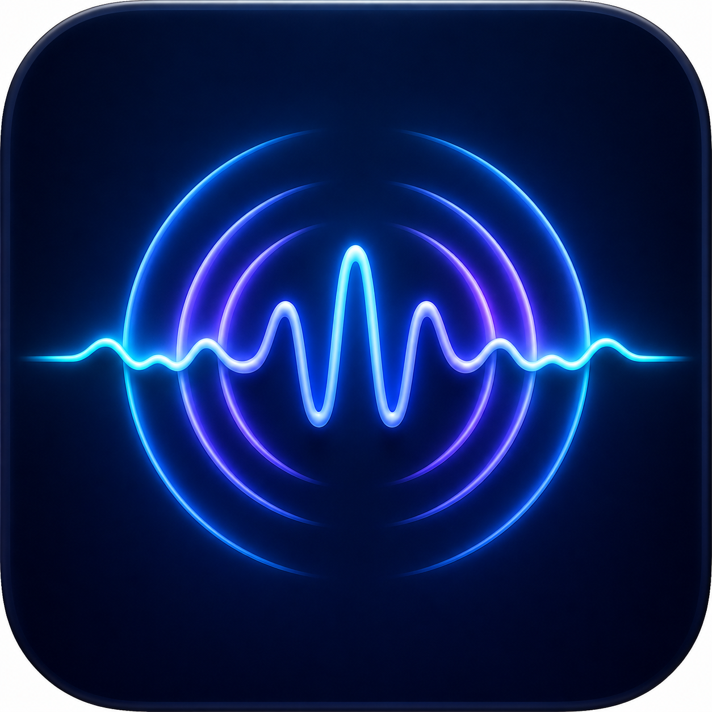

# OpenSoundstage

OpenSoundstage makes macOS audio wider and more coherent. It uses a native
Core Audio tap and a small real-time DSP pipeline. It does not install a
permanent audio driver.



The app includes eight restrained starting presets and a complete 10-band equalizer:

- **Whole** adds weight, clarity, stereo width, and controlled gain.
- **Club** adds focused low-end punch, restrained low-mid space, and controlled drive.
- **Bass** deepens low frequencies without an extreme boost.
- **Voice** improves dialogue, podcast, and vocal presence.
- **Night** reduces dynamic jumps and keeps extra limiter headroom for quiet listening.
- **Detail** adds definition while keeping the low end restrained.
- **Wide** opens the stereo image and lifts high-frequency detail.
- **Gentle** uses lighter processing for long listening sessions.

The equalizer has bands at 32, 64, 125, 250, 500, 1k, 2k, 4k, 8k, and
16k Hz. The response graph is calculated from the same biquad coefficients
that process the audio. The live stereo waveform and peak/RMS meters use the
actual post-DSP samples. The waveform uses a fixed full-scale axis and does not
normalize its shape for display. A Hann-windowed 2,048-frame FFT draws the live
post-DSP spectrum behind the coefficient-derived EQ response. Presets are also
available from the menu bar when processing is stopped.

## Requirements

- macOS 14.4 or later
- Apple silicon or Intel Mac
- Xcode 15.3 or later

## Build the app

Run these commands from the repository root:

```sh
swift test
Scripts/build-app.sh
open dist/OpenSoundstage.app
```

The build script creates an ad hoc signed app. For distribution, use an Apple
Developer ID certificate and notarize the app. The first start can trigger
macOS's System Audio Recording prompt. Locally rebuilt, ad-hoc signed copies can
prompt again because their signing identity changes; a Developer ID signed
release keeps a stable identity.

## Use the app

1. Stop other system audio processors.
2. Open `dist/OpenSoundstage.app`.
3. Select a preset.
4. Adjust the equalizer, stereo width, input gain, or soft drive if necessary.
5. Select **Start sound**.
6. Allow system audio access if macOS asks for it.
7. Select **Stop sound** before you use another audio enhancer.

OpenSoundstage follows the current default output. It stops before sleep. It
starts again after wake if it was active before sleep.

## How it works

The app creates a private Core Audio process tap. The tap excludes the app
itself and mutes the original stream while it is active. A private aggregate
route connects the tap to the current output device. Drift compensation is
enabled for the tap. The app destroys the route and the tap when you stop
sound or quit the app.

The DSP pipeline applies these stages:

1. High-pass protection
2. Ten peaking equalizer filters
3. Mid-side stereo width
4. Stereo-linked compression
5. Soft saturation
6. Stereo-linked output limiting at the profile ceiling (-1 or -2 dBFS)

Processed samples also enter a bounded lock-free monitoring ring. The user
interface reads only a copy of the latest samples. It never blocks the audio
callback and it never stores or sends audio.

See [ARCHITECTURE.md](ARCHITECTURE.md) for more information.

## Privacy and product health

OpenSoundstage does not send analytics or audio. It keeps a small product
health report on the Mac. The report has launch, route, listening-time, and
preset-selection counters. It does not include audio, device names, file names,
or personal identifiers.

Select **Product health** to view, copy, or reset the report. Read
[PRIVACY.md](PRIVACY.md) for the complete data policy.

## Safety notes

- Start with a low hardware volume.
- Do not use two system audio enhancers at the same time.
- Wider processing cannot add width to a mono signal.
- The limiter reduces digital clipping risk. It cannot protect your hearing.
- Bluetooth headset mode can reduce quality when the headset microphone is in
  use. Select the Mac microphone for calls when possible.

## Test status

The automated suite covers silence, mono compatibility, stereo width, limiter
ceiling, EQ coefficient response, preference migration, waveform sample
integrity, dBFS meter math, preset safety bounds, and FFT frequency/level
calibration. See the latest GitHub Actions run for the published commit. Manual
playback results are stated in each release note.

## Contribute

Read [CONTRIBUTING.md](CONTRIBUTING.md) before you send a change. Report a
security problem as described in [SECURITY.md](SECURITY.md).

The product brief, customer journey, metrics, and release gates are in
[docs/](docs/PRODUCT.md).

## License

OpenSoundstage uses the MIT License. See [LICENSE](LICENSE) and
[ThirdParty/NOTICE.md](ThirdParty/NOTICE.md).
